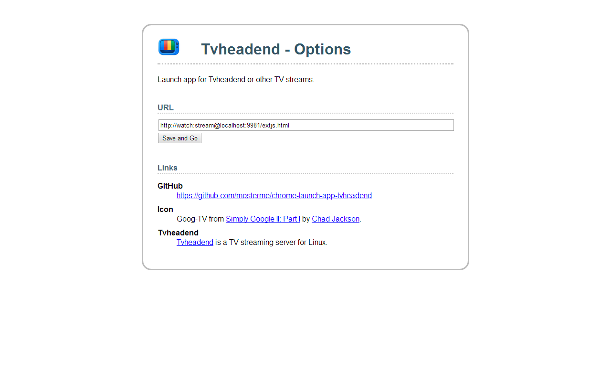

chrome-launch-app-tvheadend
===========================

Chrome launch app for Tvheadend or other TV streams. ([webstore](https://chrome.google.com/webstore/detail/launch-app-tvheadend/kajhoakhgbfhcgndmklpfeoblleohkcl))

Just enter the URL for your tvheadend server in the options and you are ready to go.

If you really want to, you could also use it to launch [vimeo](https://vimeo.com/) or even [youtube](http://youtube.com/).

. . . . . . . . . . . . . . . . . . . . . . . . . . . . . . . . . . . . . . . 

###### Icon Goog-TV from [Simply Google II: Part I](http://chadjackson.deviantart.com/art/Simply-Google-II-Part-I-192918636) by [Chad Jackson](http://chadjackson.deviantart.com/).
###### [Tvheadend](https://tvheadend.org) is a TV streaming server for Linux. ([github](https://github.com/tvheadend/tvheadend))
